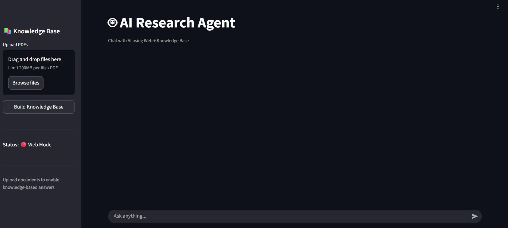
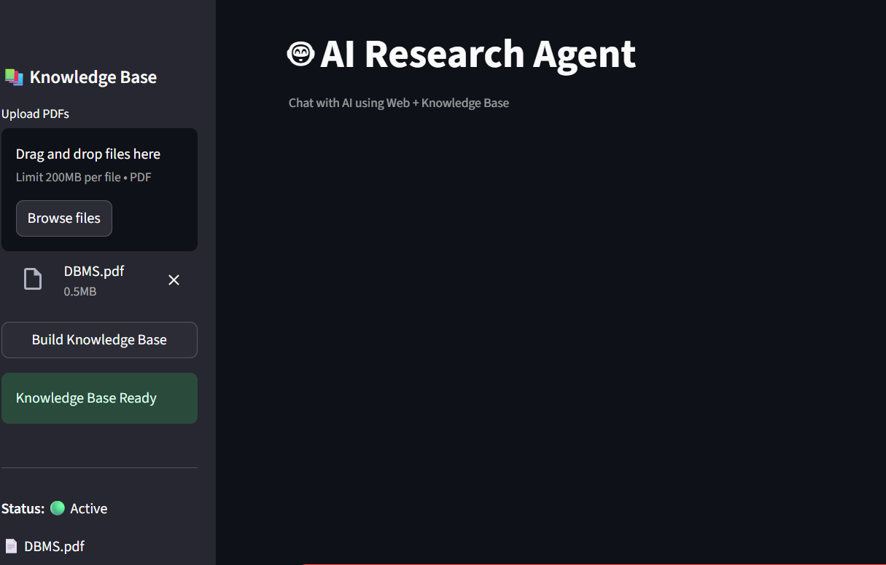
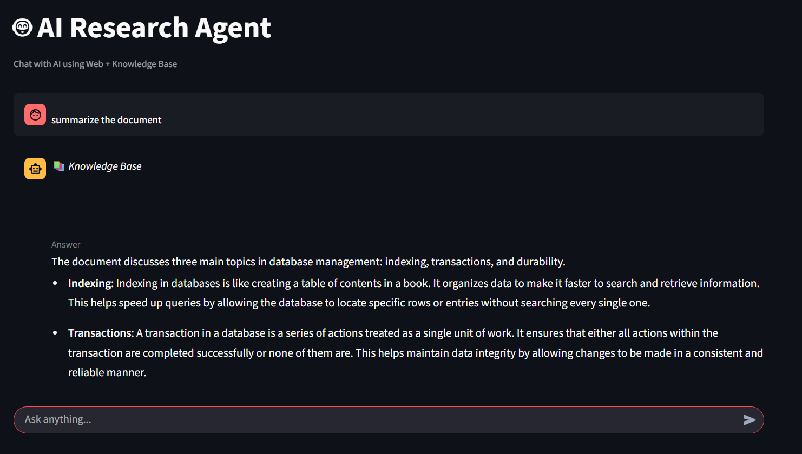
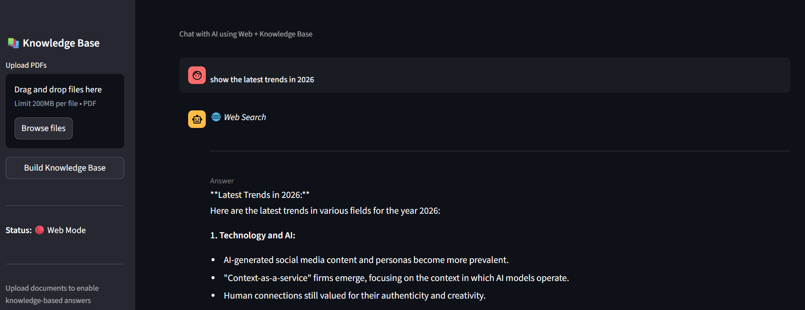

# 🤖 AI Research Agent

An AI-powered Research Assistant that combines **Retrieval-Augmented Generation (RAG)**, **Real-Time Web Search**, and **LLM-based Routing** to deliver accurate, context-aware responses.

The system intelligently determines whether a query should be answered using an uploaded knowledge base, live web search results, or a combination of both.

---

## 🚀 Live Demo

| Resource | Link |
|---|---|
| 🌐 Live Application | [https://research-agent-egbt.onrender.com] |
| 📁 GitHub Repository | [https://github.com/Akshith0711/Research_agent] |

---

## 📖 Overview

AI Research Agent is an end-to-end Generative AI application designed to provide reliable answers by dynamically combining:

- 📚 **Knowledge Base Retrieval** via RAG
- 🌐 **Real-Time Web Search**
- 🧠 **Intelligent Query Routing**
- ⚡ **Fast LLM Inference**

Unlike traditional chatbots, the system selects the most relevant information source *before* generating a response — ensuring accuracy, freshness, and context-awareness in every answer.

---

## ✨ Features

### 📚 Knowledge Base Search
- Upload one or multiple PDF documents
- Automatic document chunking and indexing
- Semantic retrieval using FAISS Vector Database
- Context-aware question answering

### 🌐 Real-Time Web Search
- Live web search powered by Tavily API
- Access to current, up-to-date information
- Automatic web content summarization

### 🧠 Intelligent Routing Agent
The system automatically decides the best retrieval strategy:
- ✅ Knowledge Base (RAG)
- ✅ Web Search
- ✅ Hybrid (Both Sources)

### 💬 Interactive Chat Interface
- Streamlit-based conversational UI
- Persistent chat history
- Source-aware responses
- PDF upload and management

### ⚡ Fast AI Responses
- Powered by Groq's Llama 3.1 model
- Low-latency answer generation

---

## 🏗️ System Architecture

```text
User Query
     │
     ▼
LLM Router
     │
 ┌───┴─────────────┐
 │                 │
 ▼                 ▼
RAG          Web Search
(FAISS)       (Tavily)
 │                 │
 └── Context Fusion ──┘
           │
           ▼
       Groq LLM
           │
           ▼
     Final Answer
```

---

## 🛠️ Tech Stack

| Category | Technology |
|---|---|
| LLM Inference | Groq (Llama 3.1 8B Instant) |
| Embeddings | Google Gemini Embeddings |
| Orchestration | LangGraph, LangChain |
| Vector Store | FAISS |
| Web Search | Tavily Search API |
| Frontend | Streamlit |
| Backend | Python |
| PDF Parsing | PyPDF |
| Config | Python Dotenv |

---

## ⚙️ Workflow

1. User submits a query
2. **Router Agent** analyzes the query intent
3. System selects the optimal information source:
   - Knowledge Base, Web Search, or Hybrid
4. Relevant context is retrieved
5. Information is summarized and fused
6. **Groq LLM** generates the final response
7. Answer is displayed in the Streamlit interface

---

## 📸 Screenshots

### 🏠 Home Page
> The main interface where users interact with the assistant.



---

### 📄 PDF Upload Interface
> Upload one or more PDF documents to build a custom knowledge base.



---

### 📚 Knowledge Base Response (RAG)
> The agent retrieves context from uploaded documents and generates an answer.



---

### 🌐 Web Search Response
> The agent fetches live results from the web when the query requires current information.



---

## 📂 Project Structure

```text
Research_Agent/
│
├── app.py                 # Streamlit UI
├── agent.py               # LangGraph Workflow
├── requirements.txt       # Python dependencies
├── README.md
├── .env                   # API keys (not committed)
├── .gitignore
└── screenshots/           # App screenshots for documentation
    ├── homepage.png
    ├── pdf_upload.png
    ├── rag_response.png
    └── web_search.png
```

---

## 🚀 Installation

### 1. Clone the Repository

```bash
git clone <repository-url>
cd Research_Agent
```

### 2. Create a Virtual Environment

```bash
python -m venv venv
```

### 3. Activate the Environment

```bash
# Windows
venv\Scripts\activate

# macOS / Linux
source venv/bin/activate
```

### 4. Install Dependencies

```bash
pip install -r requirements.txt
```

### 5. Configure Environment Variables

Create a `.env` file in the project root:

```env
GROQ_API_KEY=your_groq_api_key
TAVILY_API_KEY=your_tavily_api_key
GOOGLE_API_KEY=your_google_api_key
```

### 6. Run the Application

```bash
streamlit run app.py
```

---

## 🎯 Use Cases

- 🔬 Research Assistance
- 🏢 Enterprise Knowledge Retrieval
- 📄 Document Question Answering
- 🔍 AI-Powered Search Systems
- 🧠 Internal Knowledge Base Assistants
- 🎓 Educational Learning Platforms

---

## 🚀 Roadmap

- [ ] Conversational Memory
- [ ] Multi-Agent Architecture
- [ ] Inline Source Citations
- [ ] Docker Deployment
- [ ] Cloud Vector Databases (Pinecone / Weaviate)
- [ ] User Authentication
- [ ] Multi-Document Knowledge Bases

---

## 👨‍💻 Author

**Akshith Reddy**

Aspiring AI Engineer with a focus on:
- Generative AI & Large Language Models
- Agentic AI Systems
- Retrieval-Augmented Generation (RAG)
- Applied Machine Learning

---

## ⭐ Support

If you found this project useful, consider giving it a **⭐ star** on GitHub — it helps others discover the project and motivates further development!
